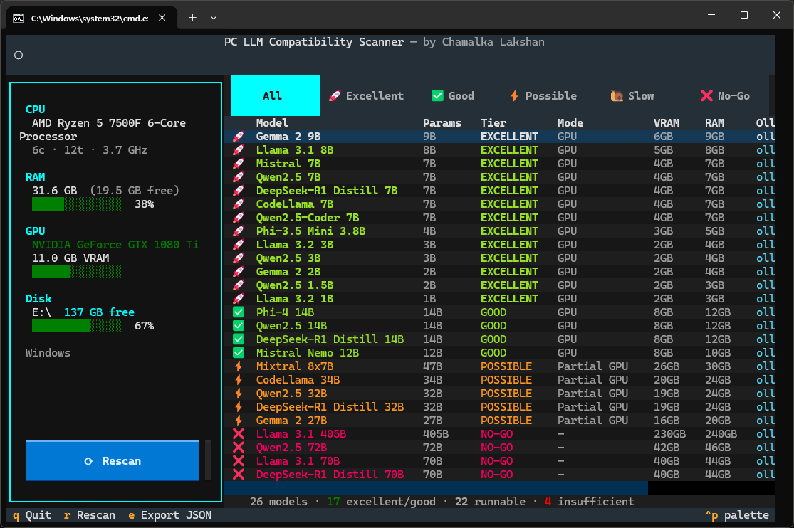

# PC LLM Compatibility Scanner (TUI)

Automatically detects your PC's hardware and tells you exactly which local LLMs you can run - and how well.



## Features

- **Hardware detection** - CPU, RAM, GPU (VRAM), disk space
- **33 LLM catalogue** - Llama, Qwen3, Gemma 3, DeepSeek-R1, Phi-4, Mistral, gpt-oss and more
- **5-tier rating system** - Excellent / Good / Possible / Slow / No-Go
- **Run mode** - GPU, CPU, partial GPU offload
- **Ollama commands** - copy-paste ready `ollama run` commands
- **Interactive TUI** - two-pane Textual UI with live filter and model detail popup
- **Export** - save results as JSON

## Quick Start

```bash
# Install dependencies
pip install -r requirements.txt

# Interactive TUI (recommended)
python ui.py

# CLI one-shot
python main.py
```

## TUI

```bash
python ui.py
```

| Key | Action |
|-----|--------|
| `r` | Rescan hardware |
| `e` | Export results to JSON |
| `q` | Quit |
| `Enter` | Open model detail popup |
| `↑ ↓` | Navigate model list |
| Filter buttons | Filter by tier |

## CLI Usage

```bash
# Full table with top 5 picks
python main.py

# Top 10 runnable models
python main.py --top 10

# Hide models that won't run
python main.py --hide-nogo

# Only EXCELLENT tier
python main.py --tier EXCELLENT

# Detailed info for a specific model
python main.py --detail "Llama 3.1 8B"

# Export to JSON
python main.py --export-json results.json
```

## Compatibility Tiers

| Tier | Condition | Expected speed |
|------|-----------|----------------|
| 🚀 EXCELLENT | Fits in GPU VRAM with headroom | 20–80 tok/s |
| ✅ GOOD | Fits in GPU VRAM (tight) | Full GPU speed |
| ⚡ POSSIBLE | Partial GPU offload or CPU with plenty of RAM | 2–10 tok/s |
| 🐌 SLOW | CPU-only, RAM is tight | < 2 tok/s |
| ❌ NO-GO | Insufficient RAM and VRAM | Cannot load |

## Supported Models

| Family | Models |
|--------|--------|
| Llama | 3.2 1B, 3.2 3B, 3.1 8B, 3.3 70B, 3.1 405B, 4 Scout, 4 Maverick |
| Qwen | Qwen3 0.6B/4B/8B/14B/32B, Qwen3 30B-A3B, Qwen3-Coder 30B-A3B, Qwen3 235B-A22B, Qwen2.5-Coder 7B |
| Gemma | Gemma 3 1B/4B/12B/27B |
| Mistral | 7B, Nemo 12B, Small 3.1 24B, Mixtral 8x7B |
| Phi | Phi-4 Mini 3.8B, Phi-4 14B |
| DeepSeek | R1 Distill 7B/14B/32B/70B, R1 671B |
| gpt-oss | 20B, 120B |

## Requirements

- Python 3.9+
- NVIDIA GPU: `nvidia-smi` must be on PATH for accurate VRAM detection
- AMD/Intel GPU: detected via Windows WMI (VRAM may show 4 GB cap on large cards due to WMI 32-bit overflow)

## How It Works

1. `scanner/hardware.py` - detects CPU, RAM, GPU, storage via `psutil`, `py-cpuinfo`, `nvidia-smi`, and PowerShell WMI
2. `scanner/llm_database.py` - catalogue of 33 models with Q4_K_M quantised VRAM/RAM requirements
3. `scanner/recommender.py` - scores each model against your hardware and assigns a tier
4. `scanner/display.py` - renders results with `rich` for the CLI view
5. `ui.py` - interactive Textual TUI with live hardware panel, filterable model table, and detail popups

## Author

Chamalka Lakshan
